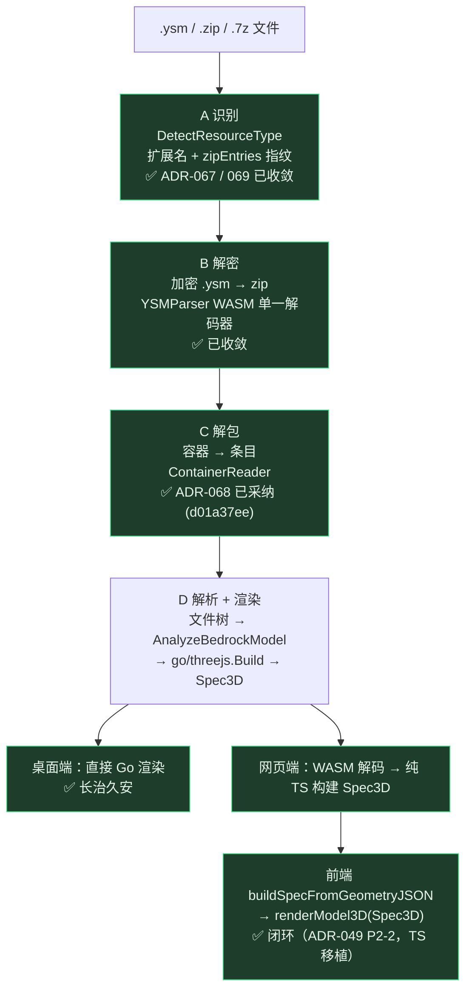

# ADR-066：全资源预览器：统一预览契约与注册表驱动分发

- **状态**：✅ 已采纳（P0 硬编码派发墙、P1 VrmAdapter、P2 MmdAdapter、P3 mountPreview 统一核心、P3-E YSM 入 core 全部已落地；`utils/3d/adapters/` 五适配器完整，统一 `mount3D` 入口）
- **日期**：2026-08-16
- **决策人**：Jieling（人类首席架构师）、AI 代理
- **相关**：`frontend/src/views/app-preview/loader.ts`、`frontend/src/views/app-preview/index.ts`、`frontend/src/views/app-preview/litematic-meta.ts`、`frontend/src/utils/resource/types.ts`、`resource_types.json`、`frontend/src/utils/3d/model3d.ts`、`frontend/src/views/app-preview/litematic-3d.ts`、`ADR-061`、`ADR-064`、`ADR-065`、`ADR-067`（zip 化资源识别，P0.x 硬前置）、`ADR-072`（物理归置补完：适配器下沉 utils/3d/adapters + 派发注册表化，✅ 已落地）

---

## 1. 背景（Context）

### 1.1 目标

一个统一预览入口，按资源类型分发到对应适配器，归一化后由**单一渲染核心**呈现。新增格式 = 加一个适配器 + 注册表一条目，不污染既有渲染逻辑。资源面广（YSM 已管理 7 类），正需要 Three.js 当生态基石——但「基石」管渲染底层，格式摄入由各自的解析通道（YSMParser WASM / three-vrm / babylon-mmd）接管，职责分离。

### 1.2 当前三条（实为两条 + 缩略图）渲染路径各自为政

| 资源类型 | 扩展名 | 当前预览 | 数据源 | 现状路径 |
|---------|--------|---------|--------|---------|
| ysm | .ysm/.zip/.json | 3d | YSMParser WASM → go/threejs.Build → Spec3D | `model3d.ts`（`renderModel3D`） |
| create-blueprint | .nbt/.schematic | 3d | Go `GetNbt/SchematicVoxelData` → InstancedMesh | `litematic-3d.ts`（`createLitematic3D`） |
| litematic | .litematic | 3d | Go `GetLitematicVoxelData` → InstancedMesh | `litematic-3d.ts` |
| mmd-skin | .pmx/.pmd | **3d** | three-mmd（babylon-mmd parser） | ✅ 路线 B（已落地 `b5c8f190`） |
| vrchat-avatar | .vrca/.vrm | **3d** | GLTFLoader + @pixiv/three-vrm | ✅ 路线 B（已落地 `04ed819e`） |
| resourcepack / shaderpack | .zip | thumbnail | 纹理/mcmeta | 缩略图通道 |

`renderModel3D` 与 `createLitematic3D` 是**两套独立的 renderer / rAF loop / OrbitControls / cleanup**（现已由 ADR-066 P3 `mountPreview` 统一核心收敛）。`mmd-skin` / `vrchat-avatar` 曾是 `preview: "none"`（已改为 `3d`，见上方表格）。

### 1.3 尚未动手就撞上的墙：硬编码资源路径 / 扩展名派发

全资源预览器还没写一行代码，先在预览层摸到三处硬编码派发（这是「墙」的实体，非测试桩）：

| 位置 | 硬编码内容 | 性质 |
|------|-----------|------|
| `loader.ts:21` | `const isWasmCapable = /\.(ysm\|zip\|json)$/i.test(modelPath)` | 扩展名正则硬编码，决定走 WASM 还是 Go |
| `index.ts:108` | `if (/\.(ysm\|json)$/i.test(modelPath))`（`loadPreviewImage`） | 同上，另一处独立判断 |
| `litematic-meta.ts:212` | `const voxelFn = isNbt ? "GetNbtVoxelData" : isSch ? "GetSchematicVoxelData" : "GetLitematicVoxelData"` | 类型→Go binding 函数名**字符串分支**硬编码 |
| `model3d-loader.ts:84-89` | `getCachedSpec(model._modelPath)` / `GetModel3DSpec(model._modelPath)` | 依赖缓存里写死的 `_modelPath` 字符串 |

同一语义（「这个扩展名属于哪个类型、该走哪条加载链」）在 3+ 处各写一遍，无单一口径——新增 VRM/MMD 时，若不在 each 处补分支，预览就会静默漏掉。

> **延伸墙（`.zip` 化资源识别）已拆为独立 ADR-067**：P0 解的是「前端硬编码派发」，但 `.zip` 可被任意资源包裹（mmd/vrc/蓝图/投影的 `.zip` 当前 Go 端 `DetectResourceType` 完全识别不了），该难题落在 Go 检测核心的扩展名门槛 + 内容指纹覆盖，且 S1/S2 改动有回归风险。ADR-067 已给出 S1–S4 精确方案（S4 前端契约本批已落地），是 P1 VRM / P2 MMD 接入的硬前置。

### 1.4 根因：注册表已建，但消费端未暴露能力元数据

`resource_types.json` **已是单一事实来源**，每个类型定义了 `extensions` 与 `preview` 字段（如 `ysm` → `extensions:[.ysm,.zip,.json]`, `preview:"3d"`；`mmd-skin` → `preview:"none"`）。但前端注册表封装 `frontend/src/utils/resource/types.ts` **只导出了 ID/label 映射**：

- `RESOURCE_TYPES`（短标签→id：YSM→"ysm" / MMD→"mmd-skin" …）
- `RESOURCE_TYPE_LABELS`（id→中文名）
- `ALL_RESOURCE_TYPES`（从 JSON `id` 派生）

它**没有把 `extensions` / `preview` 能力元数据暴露给消费端**。因此预览层无法「查表得派发」，只能各自内联正则与字符串分支。墙不是「缺注册表」，而是「注册表的能力元数据没接出来」。

### 1.5 这不是新问题——与近期提交同病（先例已在 sync 层收拾过）

最近提交链正是反复治理同一类「注册表建了、消费端仍硬编码」的病灶：

- **ADR-064**（落地 commit `d05afa3e`）：同步层「scanner 单一扫描源，对比实现单点化」——消除 4 套对比逻辑、5 处扩展名过滤重复、4 处 `.json` 特判。
- **ADR-065**（落地 commit `e120b5cf`：**整合包侧资源类型语义收敛：rtype 分支注册表驱动单点**）——标题已点明范式：`resource_types.json` 已注册表化，但**消费端仍分散硬编码**，须收敛到 `types` 单点。

预览层的 `loader.ts:21` / `index.ts:108` / `litematic-meta.ts:212` 正是 ADR-065 之后**下一个尚未收敛的消费端**。治理语言应与其一致：**扩展名/加载链判定收敛到 `types` 单点，从 `resource_types.json` 派生**。

### 1.6 渲染分层认知：ysm 全链路 4 层与网页闭环（关键澄清）

全资源预览器的「难度」常被误读为「三份重复的基岩版模型解析代码」。实测 ysm 从文件到出图是一条 **4 层链路**，各层收敛状态不同——**4 层均已闭环**（桌面 Go 直渲 + 网页 TS 移植），所谓「三份重复」是误读：



| 层 | 干什么 | 收敛状态 | 归属 ADR |
|----|--------|---------|---------|
| **A 识别** | 这是 ysm 吗？ | ✅ 已收敛 | ADR-067 / 069 |
| **B 解密** | 加密 .ysm → zip 文件树 | ✅ 已收敛（YSMParser WASM 单一解码器，前端 `ysm-parser.ts` 与 Go `decode_inject.go` 同调一个 wasm） | — |
| **C 解包** | 容器 → 条目 | ✅ 已采纳（ADR-068 ContainerReader，d01a37ee 落地 `go/container` 包 + geometry/avatar/ysm 迁移，~294 行 7z 对称外壳删除） | ADR-068 |
| **D 解析 + 渲染** | 文件树 → 基岩模型 → Spec3D → Three.js | ✅ **桌面 Go 直渲 + 网页 TS 移植双闭环**（ADR-049 P2-2；WASM 路线已弃） | 路线 B 暂缓（ROI 负，见 ADR-066-routeB-research） |

**澄清两点（避免误判「三份重复」）**：

1. **桌面端没有三份重复的基岩解析**：`summary.go` 注释已自陈「供 .zip 分支与裸 ysm.json 分支共用，消除格式不对称」（`summary.go:375`），`collectArchiveFiles`（`archive.go:633/728`）的 zip/7z 收集共用同一内核，前端 `parseYsmJsonDirect` 仅轻量提取作者元数据。Go 侧「识别→解包→摘要→收集」早已是单一解码器 + 收敛分支。
2. **ADR-069（ysm 解密产物进指纹匹配）动不到渲染层**：它只收敛 **A 层（识别）** 的 `.ysm` 扩展名直判为 `zipEntries` 指纹，对 B/C/D 零影响。**D 层网页已闭环（ADR-049 P2-2，2026-08-12）**：`go/threejs.Build` 的「几何 JSON → Spec3D」变换以**纯 TS 移植**到 `frontend/src/utils/3d/spec-builder.ts`（契约镜像 `internal/app/app_model.go`，双边测试锁定：`spec-builder.test.ts` ↔ `app_model_test.go`），网页端 WASM 解码 → TS 构建 Spec3D → `renderModel3D`，不再 round-trip 回 Go。Go/TS 双实现靠双边测试维持口径（原 WASM 化路线 B 已判 ROI 负，暂缓，见 `docs/roadmap/routeB-research.md`）。

> 结论：ysm 的桌面渲染早已长治久安，**网页端也由 ADR-049 P2-2 纯 TS 移植闭环**（spec-builder.ts 双边测试锁定，非"三份重复"——Go 与 TS 是镜像实现非散装）。原「D 层网页断裂」表述为过时认知（未反映 P2-2），已修正。ADR-069 收敛的是识别层、动不到渲染层，其边际价值有限，建议降级/暂缓、与 ADR-068 边界划清。

---

## 2. 决策（Decision）

### D1 · 注册表驱动派发（落地前置，必须先解墙）

扩展 `frontend/src/utils/resource/types.ts`，从 `resource_types.json` 派生并暴露**能力元数据**：

```ts
// 新增：类型 → 扩展名列表 / 预览模式（单一事实来源派生，vite 内联防漂移）
export interface ResourceTypeCapability { extensions: string[]; preview: "3d" | "thumbnail" | "none"; }
export const RESOURCE_CAPS: Record<string, ResourceTypeCapability> = /* 从 resourceTypesJson 派生 */;
// 新增：扩展名 → 类型 ID 反查（消灭 loader.ts/index.ts 的内联正则）
export function resolveTypeByExt(path: string): string | null;
```

预览层全部改吃注册表，删除散硬正则与字符串分支：

- `loader.ts:21` 的 `/\.(ysm|zip|json)$/` → `resolveTypeByExt(modelPath)` 命中即 WASM capable；
- `index.ts:108` 同改；
- `litematic-meta.ts:212` 的 `GetXxxVoxelData` 字符串分支 → 按 `RESOURCE_CAPS[type].extensions` 或显式 `voxelFnFor(type)` 单点映射；
- `model3d-loader.ts` 的 `_modelPath` 透传改为经注册表解析的规范 path key。

**P0 先行**：新增 VRM/MMD 前先完成 D1，否则只是把散硬从 3 处变 5 处。

### D2 · 统一预览契约 + 单一渲染核心

定义归一化抽象，把「格式差异」关进适配器：

```
PreviewAdapter (每格式一个)
   └─ load(ctx) → PreviewScene { root: Object3D; cameraHint; controls; boneProvider?; animator?; meta }
        ↓
mountPreview(container, scene)  ← 唯一渲染核心（接管 renderer / rAF / OrbitControls / cleanup / debug）
```

`renderModel3D` 与 `createLitematic3D` **都降级为「适配器 + 复用核心」**，overlay/renderer/controls 不再各写。核心只认 `THREE.Object3D` + 元信息，不关心来源。

### D3 · 适配器地图

| 适配器 | 输入 | 输出到 PreviewScene | 来源 |
|--------|------|---------------------|------|
| `YsmAdapter` | Spec3D | `root`=buildSceneMesh(spec) | 既有包一层 |
| `LitematicAdapter` / `BlueprintAdapter` | voxel JSON | `root`=InstancedMesh | 复用 litematic |
| `VrmAdapter` | .vrm/.vrca | three-vrm 场景 + springbone | 路线 B（glTF 原生，最干净） |
| `MmdAdapter` | .pmx/.pmd | three-mmd 场景 + IK + VMD 动画/相机关键帧 | 路线 B（✅ 已落地，见 §5.6） |
| `ThumbnailAdapter` | zip/meta | 缩略图卡片（不进 3D 核心） | 既有 |

### D4 · 双管线收敛

- YSM 仍走 `go/threejs.Build` → Spec3D，**不动既有契约**；
- VRM/MMD 走前端直引（three-vrm / babylon-mmd），桥接 `boneProvider`/`animator` 进统一契约；
- 二者都进同一 `mountPreview`——「通用化单一管线」偏好成立，新增格式只加适配器。

### D5 · 富格式走前端直引（路线 B，已拍板）

VRM 用 `@pixiv/three-vrm` + `GLTFLoader`；MMD 用 `babylon-mmd` 的 Three.js 适配（`@moeru/three-mmd`，其 parser 直接借 `babylon-mmd`）。MMD 解析大脑在 Babylon 侧，与联邦 Babylon 9.19.x 栈天然对齐。**P2 已落地**（`mmd-adapter.ts`，含 VMD 动画/IK/morph/toon/Ammo 物理全开）。

### 范围变更（实施后更新）

- ~~动画播放：默认静态预览~~ → **已完成**。MMD 动画（`mmd-adapter.ts:674-703`，`VmdObject.ParseFromBuffer` + `buildAnimation` + `buildCameraAnimation` + `mmd-controls.ts` 播放/暂停面板）+ VRM 动画（`vrm-adapter.ts`，`.vrma` 动作库 + springbone）均已实现，`mmd-anim-library.ts` 提供动作库路径解析。**音频播放归 babymmd 客户端**（ADR-073），YSM 仅管理/预览不播放。
- 缩略图类型（resourcepack/shaderpack）是否进统一入口：维持独立缩略图卡片，仅 3D 类型纳入 `mountPreview`。
- `go/threejs.Build` 跨平台：已由 ADR-049 P2-2 纯 TS 移植解决（`spec-builder.ts` 双边测试锁定），原 WASM 化路线 B 暂缓（ROI 负，见 `docs/roadmap/routeB-research.md`）。

---

## 3. 后果（Consequences）

**正面**：
- 消灭扩展名/加载链硬编码，与 ADR-064/065 同一治理语言，口径单点维护；
- 新增格式只加「适配器 + 注册表一条目」，不再散硬；
- 单一渲染核心去重，相机/cleanup/debug 一次做对；
- VRM/MMD 直引天然跨平台，契合「网页 + 移动 + 桌面」全平台定位。

**负面 / 风险**：
- ~~🔴 **MmdAdapter 成熟度**：three-mmd 实验态~~ → ✅ **已落地**（2026-08-16 `b5c8f190`，`mmd-adapter.ts` 1242 行）。`@moeru/three-mmd` v0.1.1 + `@moeru/three-mmd-physics-ammo` Ammo.js 物理后端，含 VMD 动画/IK/morph/toon 全开，`mmd-adapter.test.ts` 全覆盖。性能优化见 ADR-101。
- 🔴 **坐标口径（陷阱 #11）**：vrm/mmd 自带坐标系，需验证与现有相机/网格对齐，避免历史 9 次 fix 重演。
- 🟡 **依赖体积**：three-vrm + babylon-mmd parser 增包体，需 tree-shaking 评估。
- 🟡 **D1 迁移面**：`loader.ts`/`index.ts`/`litematic-meta.ts` 三处散硬判断须迁移到 `types` 单点，含对应测试断言迁移。

**已知遗留**：
- `go/threejs.Build` 跨平台：已由 ADR-049 P2-2 纯 TS 移植闭环（`spec-builder.ts` 双边测试锁定），原 WASM 化路线暂缓（ROI 负，`docs/roadmap/routeB-research.md`）——不阻碍 VRM/MMD 前端直引。
- `RESOURCE_TYPES` 短标签≠JSON 全名（`types.ts:2-4` 注释），`resolveTypeByExt` 须基于 `extensions` 而非 label，避免与 Go 端 `ScanModelEntriesWithLabel` 语义混淆。

---

## 4. 数据溯源

- **来源**：用户对话（2026-08-16，「还没开始折腾就栽在硬编码资源路径上」）+ 代码审计（`frontend/src` grep 扩展名/binding 派发 + `git log` 近期提交）。
- **硬编码排查清单（「墙」实体，file:line）**：
  - `frontend/src/views/app-preview/loader.ts:21` — `/\.(ysm|zip|json)$/i` 内联正则；
  - `frontend/src/views/app-preview/index.ts:108` — `/\.(ysm|json)$/i` 内联正则（`loadPreviewImage`）；
  - `frontend/src/views/app-preview/litematic-meta.ts:212` — `GetNbtVoxelData / GetSchematicVoxelData / GetLitematicVoxelData` 字符串分支；
  - `frontend/src/views/app-preview/model3d-loader.ts:84-89` — 依赖缓存写死的 `_modelPath`。
- **注册表现状 vs 缺口**：`resource_types.json` 已含 `extensions` + `preview` 单一事实来源；`frontend/src/utils/resource/types.ts` 仅导出 `RESOURCE_TYPES` / `RESOURCE_TYPE_LABELS` / `ALL_RESOURCE_TYPES`（id/label），**未暴露 extensions/preview 能力元数据**——消费端因此无法驱动，被迫散硬。
- **近期提交先例（治理范式引用）**：
  - ADR-064 落地 `d05afa3e`（scanner 单一扫描源 + 对比单点化，消除多处扩展名过滤/`.json` 特判重复）；
  - ADR-065 落地 `e120b5cf`（**整合包侧 rtype 语义收敛：注册表驱动单点**）——标题即范式：注册表已建、消费端仍硬编码须收敛。
  - 结论：预览层是 ADR-065 之后**下一个待收敛的消费端**，D1 与 ADR-065 同构。
- **必做 diff（registry-driven 改造最小改动面）**：
  1. `types.ts`：新增 `ResourceTypeCapability` 接口 + `RESOURCE_CAPS`（从 JSON 派生）+ `resolveTypeByExt(path)`；
  2. `loader.ts:21` / `index.ts:108`：内联正则 → `resolveTypeByExt`；
  3. `litematic-meta.ts:212`：字符串分支 → `voxelFnFor(type)` 单点映射（并入 `types` 或 `litematic-meta` 常量表）；
  4. 补/迁移断言：扩展名→类型解析、voxelFn 映射的单元测试。
- **落地计划（P0 先解墙，再扩能力）**：
  - **P0**：D1 注册表驱动派发（解硬编码墙，零新格式）；
  - **P1**：`VrmAdapter`（three-vrm，最干净，价值最高）；
  - **P2**：`MmdAdapter`（three-mmd，✅ 已落地 `b5c8f190`，含 VMD 动画）；
  - **P3**：ysm/blueprint/litematic 包成适配器接入 `mountPreview` 单一核心，消灭双 renderer；
  - **P4**：跨平台——ysm 的 `go/threejs.Build` 已由 ADR-049 P2-2 TS 移植闭环（WASM 化暂缓，`docs/roadmap/routeB-research.md`）；VRM/MMD 天然纯前端。

---

## 5. 实现说明（审核补注）— P0 已落地 `0615b21d`

### 5.1 实际代码 diff（registry-driven 改造落地面）

**`frontend/src/utils/resource/types.ts`**（新增能力元数据派生层，单一事实来源）：
- 新增 `extOf(path)`：路径→小写扩展名（含点）；
- 新增 `RESOURCE_CAPS: Record<string, ResourceCap>`：从 `resourceTypesJson` 派生，暴露 `extensions` / `preview` / `label` / `icon`；
- 新增 `matchTypeByExt(path, typeId)`：按注册表 extensions 判定归属（不处理歧义）；
- 新增 `resolveTypeByExt(path)`：扩展名→类型 ID 反查，歧义扩展名（`.zip` 同时归属 ysm/resourcepack/shaderpack）返回 `null`，调用方回退 Go 内容检测；
- 新增 `isYsmWasmPreview(path)`：ysm 单文件（`.ysm`/`.json`）走 WASM 预览，`.zip`/`.7z` 容器由 Go `FindPreviewImage` 兜底；
- 新增 `VOXEL_RPC_BY_EXT`：`.nbt/.schematic/.litematic` → `GetNbtVoxelData/GetSchematicVoxelData/GetLitematicVoxelData` 单点映射。

**`loader.ts:21`**：`/\.(ysm|zip|json)$/i` → `matchTypeByExt(modelPath, RESOURCE_TYPES.YSM)`。
- 🟢 **附带修复**：注册表 ysm `extensions` 含 `.7z`，原正则漏判 `.7z` 的 YSM 文件（硬编码副作用），现自动覆盖。

**`index.ts:108`**（`loadPreviewImage`）：`/\.(ysm|json)$/i` → `isYsmWasmPreview(modelPath)`，保留 `.zip`/`.7z` 走 Go 的语义。

**`litematic-meta.ts:212`**：三元字符串分支 → `VOXEL_RPC_BY_EXT[ext]`；同时删除 `isNbt`/`isSch` 内联正则与未使用的 `label` 死变量，改以 `extOf(path)` 单点取扩展名驱动 `ReadNbtStructure`/`ReadSchematic`/`ReadLitematicMeta` 分支。

### 5.2 验证

- `cd frontend && npm run typecheck`（tsc --noEmit）：✅ EXIT 0；
- `cd frontend && npx vite build`：✅ EXIT 0（chunk >500kB 警告为既有项，与本次无关）；
- 行为保持：ysm `.ysm`/`.json`/`.zip`/`.7z` WASM 解码路径不变；`.zip`/`.7z` 预览仍走 Go；蓝图/投影体素 RPC 选择等价迁移。

### 5.3 遗留

- `model3d-loader.ts:84-89` 的 `_modelPath` 透传未纳入 P0（属 D1 后续项，不影响 VRM/MMD 路线 B 接入点）；
- 单元测试断言迁移（§4 必做 diff 第 4 项）已补 ✅：扩展名→类型解析、AMBIGUOUS_EXTS 歧义契约（`frontend/src/utils/resource/types.test.ts`，`6e504851`）；voxelFn 映射对账契约（同文件 VOXEL_RPC_BY_EXT 3 例，2026-08-16 补）。

### 5.4 P1 — `VrmAdapter` 落地面（`04ed819e`）

**`frontend/src/views/app-preview/vrm-3d.ts`**（新增，模式对齐 `litematic-3d.ts`）：
- 模块级 `vrmGen` + `invalidateVrmPreview()` 守卫，避免快速切换模型时的旧生成器回调竞态；
- `createVrm3D(ctx, path, opts)`：`.vrm` 经 `ReadFileBytes` 取 base64 → `GLTFLoader.parse` + `VRMLoaderPlugin` 实时渲染；VRM0.0 经 `VRMUtils.rotateVRM0` 摆正；动画循环里 `vrm.update(delta)` 驱动 springbone；
- `.vrca` / `.zip` 包裹态回退 `showSimplePreview`（内容级预览属 P2 解包后处理，见 ADR-067/068）。

**`frontend/src/views/app-preview/index.ts`**（接入路由）：
- `_showModelDetail` 按 `matchTypeByExt` 分流：`.vrm` → `createVrm3D`，`.vrca`/`.zip` → `showSimplePreview`；
- `model:select` 注入 `invalidateVrmPreview()`，`disconnectedCallback` 注入 `cleanupVrm3D()`，杜绝跨实例泄漏。

**`resource_types.json` / `go/types/resource_types_embed.go`**：`vrchat-avatar.preview` `none` → `3d` 双向同步（Go 一致性测试 `TestResourceTypesEmbedJSONConsistency` 守卫，已 ✅）。

**依赖**：`frontend/package.json` 新增 `@pixiv/three-vrm ^3.5.5`。

**验证**：`npm run typecheck` ✅；`npx vite build` ✅；`go test ./go/types/...` ✅；`go build ./go/...` ✅。

### 5.5 P3 — 统一 `mountPreview` 单一渲染核心（收缴 vrm/litematic 复制脚手架，`be237aa0`）

**范围决策**（用户拍板「vrm+litematic 先入 core」）：YS

M 3D（`skeleton.ts`/`skeleton-render.ts`）是更重的模型检视器且已返回统一句柄 `Model3DHandleX`，故本轮只收敛**纯复制脚手架**的 vrm 与 litematic 两套，YS

M 留待 P3-E 经注册表单点派发。

**`frontend/src/views/app-preview/mount-preview-core.ts`**（NEW，单一事实来源）：
- 拥有通用外壳：overlay + topBar(关闭/旋转模式/速度) + viewContainer + loadingEl + scene/camera/renderer/OrbitControls/灯光 + WASD/拖拽自转 + resize + rAF + ESC + GPU 资源释放；
- 导出 `mount3D(adapter, path)` / `cleanupPreview()` / `invalidatePreview()`；模块级 `_handle` + `_gen` 代际计数防快速切换竞态；
- 定义契约 `PreviewBuildCtx` / `PreviewScene` / `PreviewAdapter` / `PreviewHandle`，**对齐 YSM 既有 `Model3DHandleX`**（方法全可选，便于纯静态渲染 + `extraControls(topBar)` 钩子挂适配器专属控件）；
- `orbitTarget` 改用 `controls.target.clone()`（避免依赖 `THREE.Vector3` 构造，兼容测试 stub）；`scene.traverse` 释放加 `typeof === "function"` 守卫；
- **loadingEl 移除交适配器在成功路径自行处理**（旧 vrm/litematic 即在 build 内 `loadingEl.remove()`），核心不强制移除，避免空数据/错误提示被误删。

**`frontend/src/views/app-preview/vrm-adapter.ts`**（NEW）：`buildVrmScene(ctx, path)` — `ReadFileBytes` → `GLTFLoader.parse` + `VRMLoaderPlugin` → `VRMUtils.rotateVRM0` → 注入 scene/灯光/包围盒定相机；`update:(dt)=>vrm.update(dt)`；`dispose:()=>VRMUtils.deepDispose(vrm.scene)`；成功路径 `ctx.loadingEl.remove()`。

**`frontend/src/views/app-preview/litematic-adapter.ts`**（NEW）：`buildLitematicScene(ctx, path, voxelFn)` — 体素 InstancedMesh + 分层 UI(axis/layer/sliders) + 灯光 + GridHelper + 定相机；分层控件经 `extraControls(topBar)` 挂入；成功路径 `ctx.loadingEl.remove()`。保留 P2/P4 修复（分层按 (group,chunk) 寻址、坐标口径陷阱 #11/#17、数字输入 0 钳到 1）。

**薄包装改写（公开符号兼容，litematic-meta.ts 与既有测试无需改动）**：
- `vrm-3d.ts`：`createVrm3D`/`cleanupVrm3D`/`invalidateVrmPreview` → 转发 `mount3D(vrmAdapter, path)`/`cleanupPreview`/`invalidatePreview`；
- `litematic-3d.ts`：`createLitematic3D`/`cleanupVoxel3D`/`invalidateLitematicPreview` → 经 `makeLitematicAdapter(voxelFn)` 工厂转发。

**ESC 异步守卫修复（原唯一失败测试「加载期间 ESC 关闭 → aborted 守卫」）**：
- 根因：`buildLitematicScene` 首 await 为 `await getApp()`（早于 `await fn(path)`），旧测试在 `createLitematic3D` 同步返回后立即 `resolveFn(VALID_JSON)`，此时 `GetLitematicVoxelData` 尚未被调用、`resolveFn` 仍是空操作 → `await p` 永久挂起超时；
- 真实泄漏：原 aborted 分支仅 `built.dispose()`，未停 rAF 循环、未 dispose renderer/scene（`_handle` 在 `closeOverlay` 已置 null），外壳资源泄漏；
- 修复：aborted 分支改调 `fullCleanup()`（完整拆除外壳 + 内容层）；测试在分发 ESC 前 `await Promise.resolve()` 让出微任务，使 build 越过 `await getApp()` 真正进入 `await fn(path)`，`resolveFn` 此刻才被真实赋值。

**验证**：`npm run typecheck` ✅；`npx vite build` ✅；`vitest src/views/app-preview/`（235 tests）全绿（含修复后的 ESC 异步守卫用例）。

### 5.6 P3-E — YSM 入 core 立项范围（2026-08-16 用户拍板补充）

**范围**：YSM 3D（`skeleton.ts`/`skeleton-render.ts`/`model3d.ts` 链路）经注册表单点派发接入 `mountPreview` 单一核心，与 RenderSession 对象化合并立项（记忆裁决：独立立项、勿 rush、陷阱 #11 高危改完须近距渲染验证）。

**新增范围（用户拍板，2026-08-16）——「3D 内模型切换悬浮按钮」**：

- **背景/动机**：`_prefer3D` 偏好语义回归修复（`b2fafea6`）后，用户主动关闭 3D 不再自动弹全屏；但用户指出「想看多个模型时更妥当的办法是在 3D 界面内加载模型」——退出 3D → 回列表 → 点下一个 → 再进 3D 的来回跳转不是正解，应在渲染器内直接切换。
- **范围**：`mount-preview-core` 的 topBar（或 overlay 内）新增模型切换入口（前/后/下拉列表），在当前 3D 会话内直接卸载旧模型、挂载新模型，复用同一 renderer/rAF/controls/灯光，不重建外壳。
- **实现位点**：`mount3D` 外壳提供切换 API（如 `mount3D` 返回的 `PreviewHandle` 增 `switchTo?(path)`，或 core 暴露 `setAdapterPath`）；各适配器 `build()` 已可复用（`PreviewAdapter` 契约天然支持换 path 重建内容层）。
- **边界**：不新增动作/场景/表情等渲染器级悬浮按钮（**VMD 动画/播放已实现**，见 `mmd-controls.ts` / `mmd-adapter.ts`；此处边界指「3D 内模型切换按钮」不与播放面板冲突，非排除动画）。
- **与既有语义的关系**：切模型由「偏好自动弹」改为「3D 内显式切换」后，`_prefer3D` 自动弹语义可逐步淡出（用户主动打开 3D 才进全屏），但保留「切模型保留偏好」不回归（`b2fafea6` 口径）。

**文件层级归置（用户拍板方案 A，2026-08-16）——3D 菜单控件代码归层**：

- **背景**：YSM 3D 控件盘点发现「散装回潮点」——相机控件（旋转/速度）在 core shared 模式（`mount-preview-core.ts:118-168`）与 YSM self 模式（`ysm-adapter.ts:214-258`）**双份实现**；`ysm-adapter.ts` 的 `extraControls` 已膨胀至 162 行（截图/纹理/模型组/相机全塞 topBar 构建），`extraPanel` 52 行，adapter 单文件 330 行控件与内容构建混在一起；旧 `skeleton-render.ts` 的 `build3DOverlay`（~190 行）在 YSM 切走 `createYsm3D` 后将成为死代码。
- **归置（方案 A）**：
  - **相机控件下沉 core**：旋转/速度/重置（⟲）统一进 `mount-preview-core.ts` 通用层，shared/self 双模式复用，消灭双份实现；
  - **YSM 专属控件拆独立文件**：截图菜单（6 项）/纹理选择/模型组选择从 `ysm-adapter.ts` 拆至新增 `ysm-controls.ts`（`extraControls`/`extraPanel` 移出 adapter），骨骼面板保持独立文件（`skeleton-fill-panel.ts` 现状不动）；
  - **adapter 瘦身**：`ysm-adapter.ts` 回归「内容构建 + 装配控件」单一职责（~100 行内），与 ADR-066「适配器 = 格式差异」定位一致；
  - **删除死代码**：P3-E 完成后移除 `skeleton-render.ts` 的 `build3DOverlay`（YSM 已走 `createYsm3D` → `mount3D`）。
- **验证口径**：与 P3-E 主立项同——`npm run typecheck` + `npx vite build` + app-preview 全量单测；陷阱 #11 坐标口径改完须近距渲染验证。

<!-- 文件名: universal-resource-preview.md → 实际文件 ADR-066-universal-resource-preview.md -->
