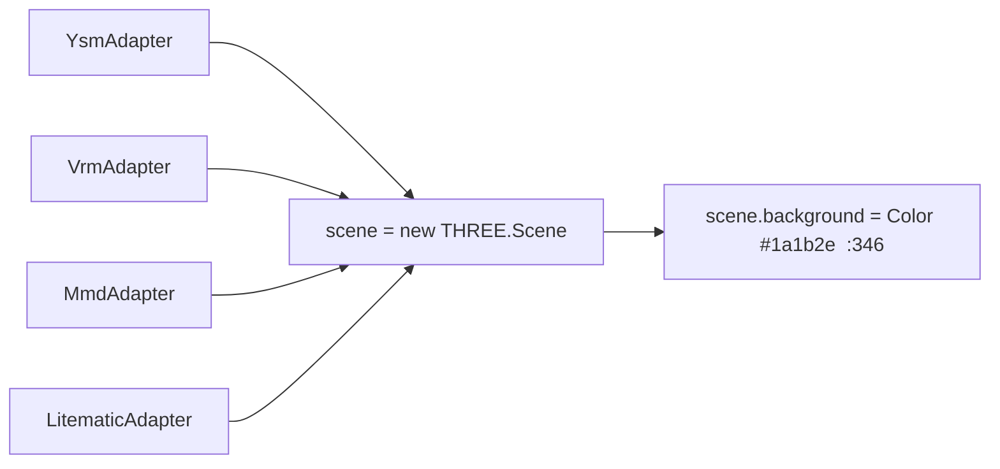

# ADR-073：联邦 3D 渲染能力共享策略（程序化天空为首个落地能力）

- **状态**：已采纳（Accepted）
- **日期**：2026-08-16
- **决策人**：Jieling（人类首席架构师）、AI 代理
- **相关**：`frontend/src/utils/3d/adapters/mount-preview-core.ts`、`docs/knowledge/preview_core.md`、`ADR-066`、`ADR-072`、`ADR-004`

---

## 1. 背景（Context）

### 1.1 联邦引擎格局（关键前提）

联邦并未统一引擎，并存两个独立栈：

- **MikuMikuAR** = Babylon.js（`babymmd`，Babylon MMD）——独立 App，thriving，未动；
- **ysm-model-manager** = Three.js，由「YSM 浏览器」重建为「全模型预览器」（`mount-preview-core.ts` 统一核心已落地，ADR-066 P3 `be237aa0`）——支持 YSM / VRM（`@pixiv/three-vrm`）/ MMD（`@moeru/three-mmd`，parser 借 `babylon-mmd`）/ Litematic / Blueprint。

双栈并存是**设计结果**而非疏漏：因 `babymmd` 独立性无法跨栈复用，YSW 侧独立重建，互不拖累。

### 1.2 用户诉求与核心矛盾

用户诉求：「最好 MMD 有程序化天空，YSM 与 VRM 自动获得相应能力」。

该诉求默认了「能力自动互通」假设。在联邦双栈格局下必须**拆层**判断：

- **同引擎域内**（ysm-model-manager 内 YSM/VRM/MMD 全走 Three 统一核心）→ 能力共享是字面真·自动；
- **跨引擎栈**（→ MikuMikuAR Babylon）→ 能力不自动，须桥接或各自独立。

### 1.3 统一预览核心已提供「域内自动」的物理基础（ADR-066 P3 已落地）

`frontend/src/utils/3d/adapters/mount-preview-core.ts` 是单一渲染核心，所有适配器经 `build(ctx)` 挂进**同一个 `ctx.scene`**：

因此「MMD 有天空 → YSM/VRM 自动获得」在 ysm-model-manager 域内**已具备零成本实现路径**：只改 `:346` 的 `scene.background` 升级为程序化天空，四种模型零改动继承。MMD 因走 Three 的 `@moeru/three-mmd` 同属该 `scene`，也能吃到，无需 Babylon 那套。

### 1.4 平行旧链路需同步

`frontend/src/utils/3d/renderer-setup.ts:44`（旧 `RenderSession`，`model3d.ts`）也设同款纯色背景。新增天空须两处同步，或后续收敛，避免视觉分叉。

### 1.5 跨栈不自动是既定事实

MikuMikuAR 是独立 Babylon App，不在同一个 `ctx.scene`。其天空（若用 Babylon `SkyMaterial`/HLSL）无法直接喂给 Three 域。要联邦一致，只能共享**渲染数学**（GLSL），引擎绑定各自写。

---

## 2. 决策（Decision）

### D1 · 联邦渲染能力共享分层模型

| 层级 | 范围 | 能力共享机制 | 是否自动 |
|------|------|-------------|---------|
| **L1 域内**（ysm-model-manager 统一核心） | YSM/VRM/MMD/Litematic 共用 `ctx.scene` | 改 `mount-preview-core.ts` 一处 `scene.background`，经 `SkyCapability` 封装 | ✅ **真·自动**（零改动继承） |
| **L2 跨栈**（→ MikuMikuAR Babylon） | 独立 App，不共享 `ctx.scene` | 引擎中立 GLSL 核心 + Babylon 薄适配器，或各自独立实现 | ❌ **不自动**（须桥接） |

**原则**：能力「写一次、消费方零重复」的前提是**同引擎 + 同渲染核心**。跨引擎域只能共享「数学」，不能共享「材质 / 场景对象」。

### D2 · 程序化天空落点与契约（L1，首个落地能力）

- **落点**：`mount-preview-core.ts:346` 的 `scene.background` → 升级为 `SkyCapability` 注入的天空（sky mesh / `ShaderMaterial` / `scene.environment`）。
- **封装**：新增 `SkyCapability` 接口（`setTime(hour)` / `setWeather(turbidity, rayleigh, mieCoefficient, mieDirectionalG)` / `mount(scene)` / `dispose()`），由 `mountPreview` 在 shared 模式统一装配，**各适配器不感知天空存在**。
- **准入机制**：场景级 `federal.use('sky', ctx)` 按 `ctx.engine` 返回对应实现——本期只服务 Three 域（L1），Babylon 域（L2）留待需要。
- **遗产同步**：`renderer-setup.ts:44` 旧链路同改，或纳入后续核心收敛（见 §3 遗留）。

### D3 · 实现选型：复用 Three 官方 `Sky`，不重造

- 直接采用 `three/examples/jsm/objects/Sky.js`（Preetham 大气散射，成熟稳定），外包一层 `SkyCapability` 接口；**禁止自行实现大气散射 shader**（属过度工程，违背 ADR-066「复用已有」偏好）。
- 仅当官方 `Sky` 不满足（如需要体积云 / 极光）才评估自写轻量版，且仍走 `SkyCapability` 契约。
- 与 `scene.environment`（PMREM 环境光照）联动，让天空同时充当 IBL 光源，提升 YSM/VRM/MMD 材质真实感。

### D4 · 跨栈策略（L2，本期不立项）

- **默认**：MikuMikuAR 的天空由其自有 Babylon 栈独立实现，联邦层面不强制一致（L1 已是主力预览面）。
- **可选联邦化路径**（若未来要求双栈视觉一致）：抽取**引擎中立 GLSL 散射核心** + Babylon 薄适配器（~80 行接 `SkyMaterial`/HLSL），复用 L1 同一套 uniform 语义（`setTime` / `setWeather`）。此路径仅当 L2 需求明确时立项，不预支抽象。

### D5 · 红线与可复用范式

- 🔴 **红线 1**：联邦渲染共享层必须是「可 import 的包 / 模块」，绝不能是「把某城邦迁到对方引擎」。不得为统一天空把 ysm-model-manager 迁到 Babylon，或把 MikuMikuAR 迁到 Three——各自引擎栈保留。
- 🔴 **红线 2**：新增能力（bloom / DOF / 地面 / 灯光预设）一律复用「GLSL/TS 核心 + 薄适配器 + 能力注册表」同一套路，禁止为单点需求写一次性散装代码（呼应 AGENTS.md 对「推倒重来 / 散装」的警告）。
- 🟢 **能力注册表**：`federal.use(cap, ctx)` 是「自动获得」的统一机制；后续能力三城邦（YSM/VRM/MMD 同域）齐活只需加一个实现。

---

## 3. 后果（Consequences）

**正面**：
- 用户原诉求在 L1 字面成立：MMD 天空经统一核心自动惠及 YSM/VRM，零重复、零迁移风险（正是用户「通用化复用」偏好的兑现）。
- 天空经 `SkyCapability` 封装 + `scene.environment` 联动，一次做对相机 / 光照 / IBL，四种模型一致。
- 建立「联邦渲染能力共享」范式，bloom/DOF/ground 等后续能力只需加实现，杜绝散装回潮。

**负面 / 风险**：
- 🔴 **跨栈分叉**：MikuMikuAR（Babylon）无法自动获得 L1 天空，双栈视觉可能不一致——须用户接受「L1 为主预览面、L2 独立」或未来走 D4 联邦化路径。
- 🟡 **旧链路同步**：`renderer-setup.ts:44` 须同步改，否则 YSM 旧 `RenderSession` 与统一核心视觉分叉。
- 🟡 **依赖体积与开销**：`three/examples/jsm/objects/Sky.js` 轻量，但 `scene.environment` 的 PMREM 有计算开销，须评估低配 / 移动端（呼应 ADR-047 / ADR-071 能力边界）。
- 🟢 **坐标口径**：天空为无穷远背景，不引入变换，陷阱 #11（坐标系对齐）不受影响。

**已知遗留**：
- `renderer-setup.ts:44` 旧 `RenderSession` 天空同步或收敛（不阻塞 L1 落地）。
- L2 联邦化路径待立项（仅当跨栈一致需求明确）。
- MmdAdapter 成熟度风险（ADR-066 §3 / ADR-072 §3）不因本 ADR 改变——天空是场景级能力，与 MMD 适配器内部状态无关。

---

## 4. 数据溯源

- **来源**：用户对话（2026-08-16 多轮）：「是不是要往项目塞程序化天空」→「盘两边 3D 能力要不要打通，最好 MMD 有程序化天空，YSM 与 VRM 自动获得」→「该更新记忆了」（双引擎格局校准）→「全套包括 [MMD-in-Three]，可以查看文档代码完善记忆」→「起 ADR 吧，把各种思路汇聚起来」。
- **代码审计（file:line）**：
  - `frontend/src/utils/3d/adapters/mount-preview-core.ts:344-346` — `scene = new THREE.Scene()` + `scene.background = new THREE.Color("#1a1b2e")`：天空唯一落点，所有适配器共用同一 `scene`；
  - `frontend/src/utils/3d/renderer-setup.ts:44` — 旧 `RenderSession` 设同款纯色背景（须同步）；
  - `frontend/src/utils/3d/adapters/{ysm,vrm,mmd,litematic}-adapter.ts` — 均经 `build(ctx)` 注入 `ctx.scene`（统一核心契约，ADR-066 P3 `be237aa0` 落地）。
- **联邦引擎格局校准**：`~/.workbuddy/USER.md` 技术栈基线已补「双引擎并存 + 域描述」；`docs/knowledge/preview_core.md` 新建卡记录 sky 落点 `:346` 为不变量。
- **关联 ADR**：ADR-066（统一预览契约 + 单一渲染核心，本 ADR 的物理前提）、ADR-072（3D 代码归置，适配器已下沉 `utils/3d/adapters/`）、ADR-004（3D 渲染管线与坐标系）。
- **实现最小改动面（L1 落地，待执行）**：
  1. 新增 `frontend/src/utils/3d/caps/sky-capability.ts`：`SkyCapability` 接口 + `createThreeSky()`（包 Three `Sky` + PMREM `scene.environment` 联动）；
  2. `mount-preview-core.ts:346`：`scene.background = new THREE.Color(...)` → `applySkyCapability(ctx, createThreeSky())`；
  3. `renderer-setup.ts:44`：同步；
  4. 验证：`npm run typecheck` + `npx vite build` + app-preview 单测 + 近距渲染验证（陷阱 #11 口径）。

<!-- 文件名: federal-render-caps.md → 实际文件 ADR-073-federal-render-caps.md -->
